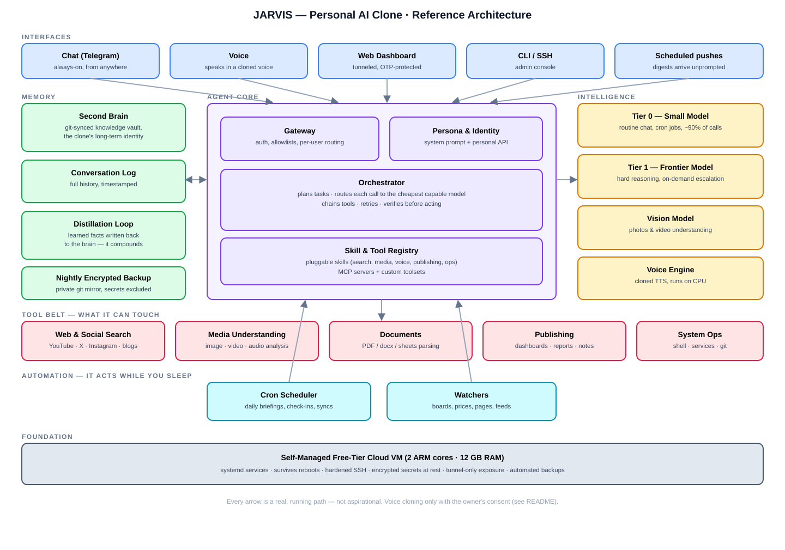

# JARVIS — a self-hosted personal AI clone

  

> Your voice. Your memory. Your agent — running 24/7 on a free cloud VM.

**JARVIS is not a chatbot.** It is a clone: an always-on agent that *is* you in digital form. It speaks with your cloned voice, remembers everything you've ever taught it (because its brain is your own knowledge vault, git-synced), thinks with tiered LLMs so it's cheap by default and smart on demand, and — most importantly — **acts while you sleep**: scheduled jobs, watchers, research, reporting, publishing, all without you opening a laptop.

One running instance costs **~$0/month** on a free-tier cloud VM. This repo is the blueprint: architecture, design principles, and the full use-case surface of a working reference implementation that has been live since September 2026.

---

## Design principles

| # | Principle | What it means |
|---|---|---|
| 1 | **A clone, not a chatbot** | The unit of deployment is a *person*, not a conversation. Identity, memory, and voice belong to one owner and persist across every chat. |
| 2 | **Brain before mouth** | Memory is a first-class subsystem — a git-synced second brain the agent reads *and writes back to*. Answers cite the brain; new durable facts are distilled into it. The clone compounds. |
| 3 | **Cheap by default, smart on demand** | Tiered model routing: a small model handles ~90% of traffic (chat, cron, classification); a frontier model is escalated to only for hard reasoning. Token bills stay near zero. |
| 4 | **Multimodal in and out** | Text, images, video, audio, PDFs, URLs — anything you can send, it can ingest; replies come as text, voice notes, rendered dashboards, or documents. |
| 5 | **Automation-first** | If a task is recurring, it should never be requested twice. Cron jobs, watchers, and digest builders are core citizens, not plugins. |
| 6 | **Private by architecture** | Self-hosted on your own VM. No third-party SaaS sees your brain. Secrets encrypted at rest, exposure through an authenticated tunnel only, nightly encrypted backups you own. |
| 7 | **It must survive you closing the laptop** | The agent lives on a server, not your desktop. Reboots, sleeps, travel — irrelevant. 24/7 is the baseline. |

---

## Architecture

**Request flow:** any interface → gateway (auth, allowlist) → orchestrator pulls persona + relevant memory from the second brain → routes the call to the cheapest capable model → chains tools as needed → verifies → responds (text / cloned voice / dashboard) → distills any durable new facts back into the brain.

| Layer | Components |
|---|---|
| Interfaces | Telegram bot (primary, always-on), cloned-voice replies, OTP-protected web dashboard, CLI/SSH admin, scheduled push digests |
| Agent core | Gateway · Persona & identity layer (system prompt + personal API over the vault) · Orchestrator (planning, model routing, tool chaining, retries) · Pluggable skill/tool registry (MCP-compatible) |
| Memory | Git-synced second-brain vault (long-term identity), timestamped conversation log, distillation loop (writes learned facts back), nightly encrypted backup to a private mirror |
| Intelligence | Tier 0 small model (routine), Tier 1 frontier model (escalated), vision model (image/video), CPU voice engine with cloned TTS voices |
| Tool belt | Web & social search, media understanding, document/PDF processing, publishing (dashboards/reports/notes), system ops (shell, services, git) |
| Automation | Cron scheduler, watchers (job boards, prices, pages, feeds), digest & report builders |
| Foundation | Free-tier ARM cloud VM (2 cores/12 GB), systemd services with linger, hardened SSH, encrypted secrets, tunnel-only exposure, self-healing restart timers |

---

## What it can do

**Understands:** text · photos · video · audio/voice notes · PDFs & office docs · URLs & web pages · social content (YouTube, X/Twitter, Instagram, blogs)

**Produces:** text answers with citations from your brain · voice notes in a cloned voice · rendered HTML dashboards · formatted reports and documents · git commits into your knowledge base · actions (searches, watchers, scheduled jobs, notifications)

**Acts on schedule:** cron-driven briefings, check-ins, syncs, scrapes, backups — delivered unprompted.

---

## Use cases

A clone this general is limited by imagination, not plumbing. Catalog of what one deployment can do — most of these are running today in the reference implementation; the rest are direct extensions of the same primitives.

### Daily operating system
- **Morning briefing** — weather, calendar-style agenda, priorities from your goal notes, overnight watcher results, in one voice note or message at a fixed hour.
- **Evening check-in** — logs your day into the brain (habits, health, expenses) with a two-question interaction.
- **Deferred memory** — "remember that …" in any chat becomes a structured, searchable brain note; ask "what did I decide about X?" weeks later and get the answer with context.

### Knowledge & research
- **Ingest anything** — forward a PDF, paper, video link, or photo; it extracts, summarizes, files it into the second brain with tags, and links it to related notes.
- **Research agent** — "compare these three approaches and update my notes" → multi-source search, synthesis, written back as a cited note.
- **Reading queue** — send links all week; a weekend cron produces one consolidated digest of everything worth keeping.
- **Ask-your-brain search** — natural-language queries over years of your own notes, answered with references.

### Content & social
- **Social monitoring** — watch YouTube channels, X/Twitter accounts, Instagram profiles, or blogs for topics you care about; get a filtered digest (it knows your taste because it *is* your taste).
- **Draft assistance** — content drafted in your voice, sourced from your own stories and notes, ready to paste.
- **Comment & reply triage** — summarize threads you were tagged in, draft responses for approval.

### Career co-pilot
- **Job-board watcher** — nightly scans of target company boards, filtered against your profile, top matches pushed with apply links.
- **Interview prep** — drills you from your own resume and project notes; the clone knows your work better than you recall under pressure.
- **Application tracking** — every applied/scheduled/rejected state lands in the brain automatically.

### Finance
- **Watchlists & alerts** — price/asset watchers with an opinionated summary in the morning digest.
- **Expense logging** — voice-note expenses parsed, categorized, appended to your ledger note.
- **Weekly money digest** — spend trends vs. budget pulled from your own recorded data.

### Health & habits
- **Protocol enforcer** — nightly check-in on a fitness/health protocol; weekly aggregates with trend read-outs logged to the brain.
- **Streak keeper** — reminds, records, and nags — kindly — over chat.

### Home & family ops
- **Family memory** — medical history, service dates, documents, contacts — queryable by voice from anywhere ("what dosage did the doctor change to?").
- **Household watchdogs** — anything with a page or a feed: order status, appointment slots, bill due dates.

### Team & org clones
The same architecture with a shared brain becomes an **org clone**: an always-on teammate that knows the team's docs, answers "where is X documented?", onboards new joiners, and runs the standup digest. One VM, one brain, many readers.

---

## The stack

| Layer | Choice | Why |
|---|---|---|
| Agent runtime | [Hermes Agent](https://hermes-agent.nousresearch.com/) (MIT) | harness only — no local models needed, skill/MCP ecosystem |
| Brain storage | [Obsidian](https://obsidian.md) vault in a private git repo | plain-text, durable, two-way sync between human and agent |
| LLMs | Any provider with tiered models | routing keeps ~90% of calls on the small tier |
| Voice | [Pocket-TTS](https://kyutai.org/) (100M params, CPU) | real-time cloned speech on 2 ARM cores, no GPU |
| Compute | Free-tier ARM VM (2 OCPU / 12 GB) | the whole clone fits, with headroom |
| Access | Cloudflare Tunnel + Access OTP | no open ports, authenticated dashboard |
| Backups | Nightly encrypted git mirror | the brain survives the VM |

## Running cost

| Item | Cost |
|---|---|
| VM (free tier) | $0 |
| Agent runtime (MIT) | $0 |
| TTS (local, CPU) | $0 |
| LLM tokens | ~free on a coding-plan subscription with tier-1 routing |
| **Total** | **~$0/month** |

## Self-hosting (the 10,000-ft version)

1. Provision any 2-core VM (free tiers exist) — Ubuntu, hardened SSH, keys only.
2. Install the agent runtime; point it at your LLM provider (small default model, frontier on demand, vision-capable model for media).
3. Clone your brain repo onto the VM; add a persona/system prompt; enable a 30-min pull timer so the agent always reads fresh memory.
4. Wire one chat interface (a Telegram bot is 5 minutes), one voice service, and systemd units with linger.
5. Add cron jobs one habit at a time. That's the product loop: **habit → cron → digest → memory → better answers.**

## Roadmap

- [ ] Open-sourcing the skill pack (voice, watchers, distillation, dashboard publisher)
- [ ] Multi-user brains on one VM (org clones)
- [ ] Email + calendar interfaces alongside chat
- [ ] Local STT for full voice-loop conversations

## Ethics & consent

Voice cloning is powerful and personal. JARVIS's rule: **clone only your own voice, or voices with explicit recorded consent.** The reference implementation follows this strictly; anyone forking this blueprint should too.

## License

[MIT](LICENSE) — the blueprint is yours. The brain you build on it stays yours.
